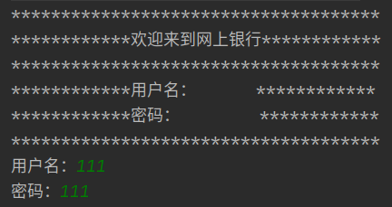
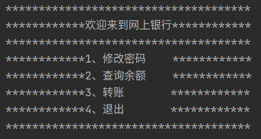

# learn_spring
学习了Spring之后做的小小的纯Spring的项目

learn_spring_xml：xml方式实现

learn_spring_annotation：注解方式实现

# learn_spring_xml

# learn_spring_annotation

很奇怪，@Service注入之后Bean找不到，报错：Exception in thread "main" java.lang.NullPointerException

先学其他知识再回来找找问题！

